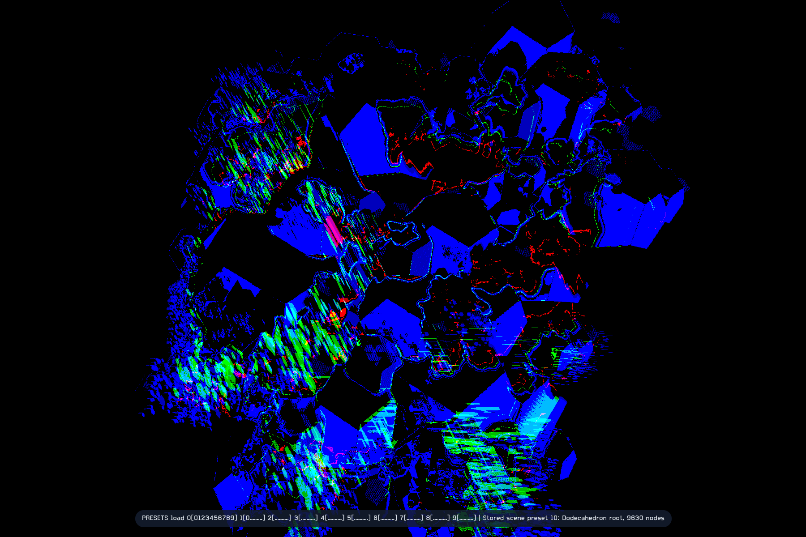
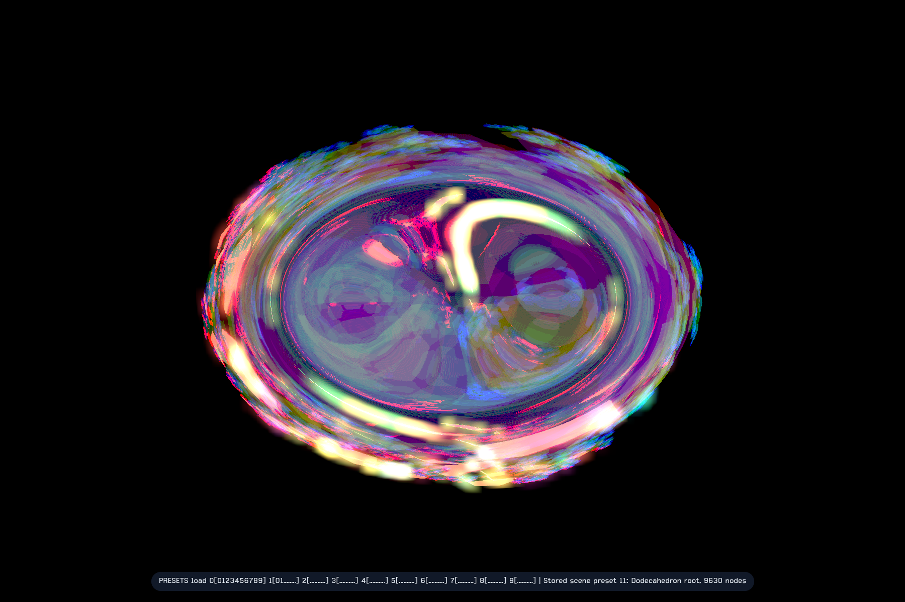
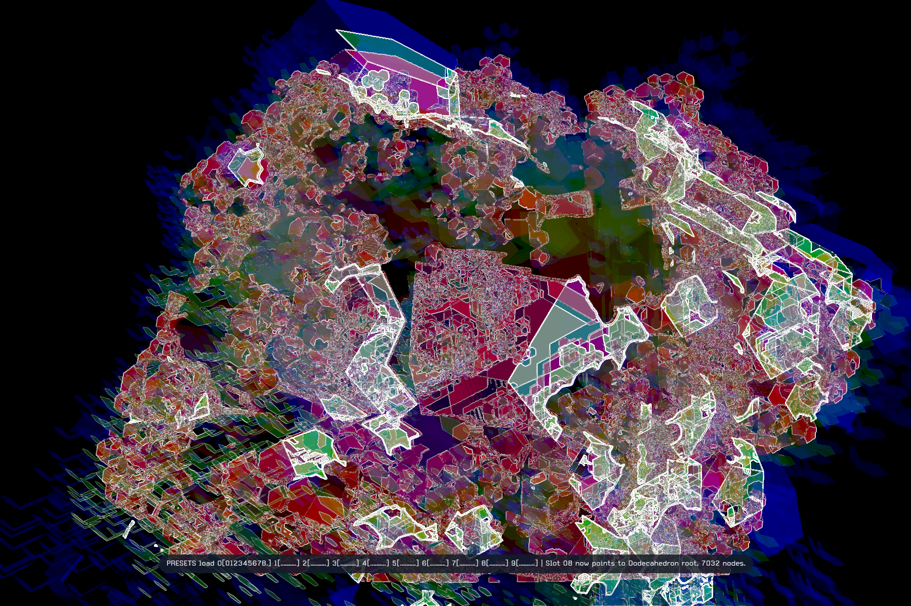
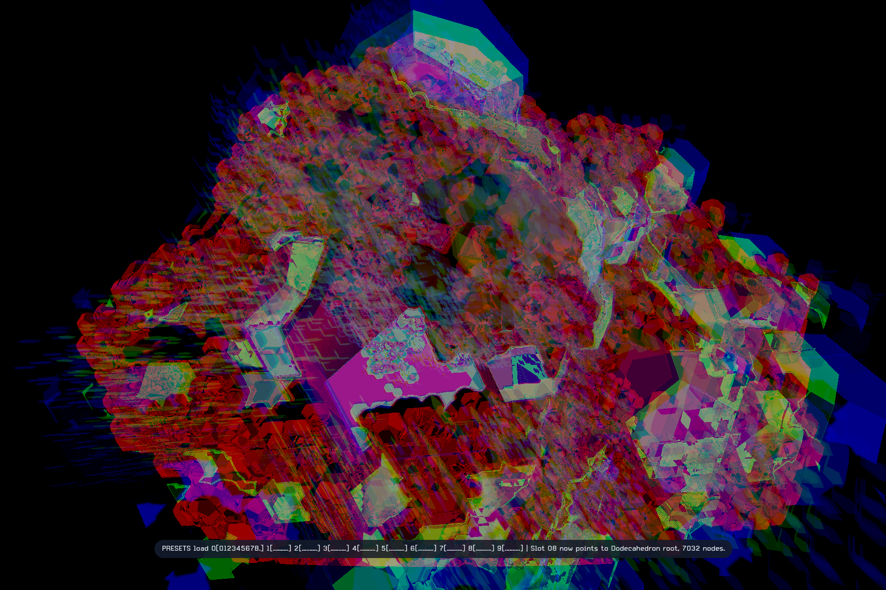
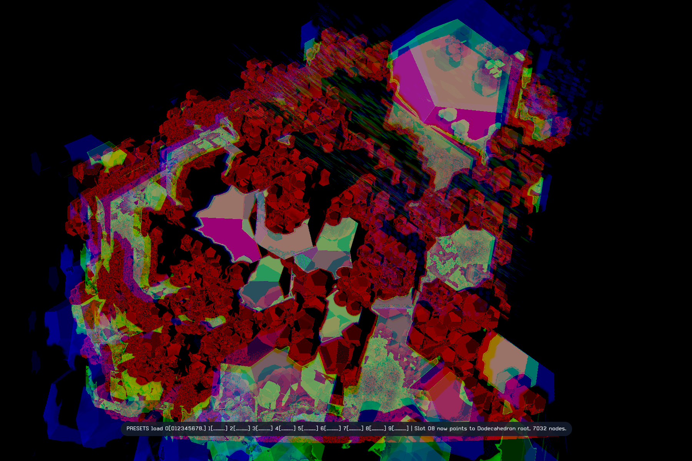
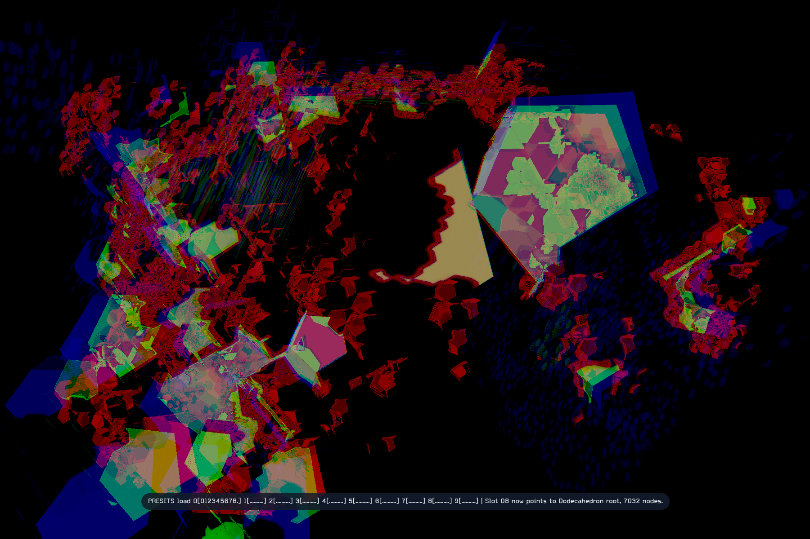
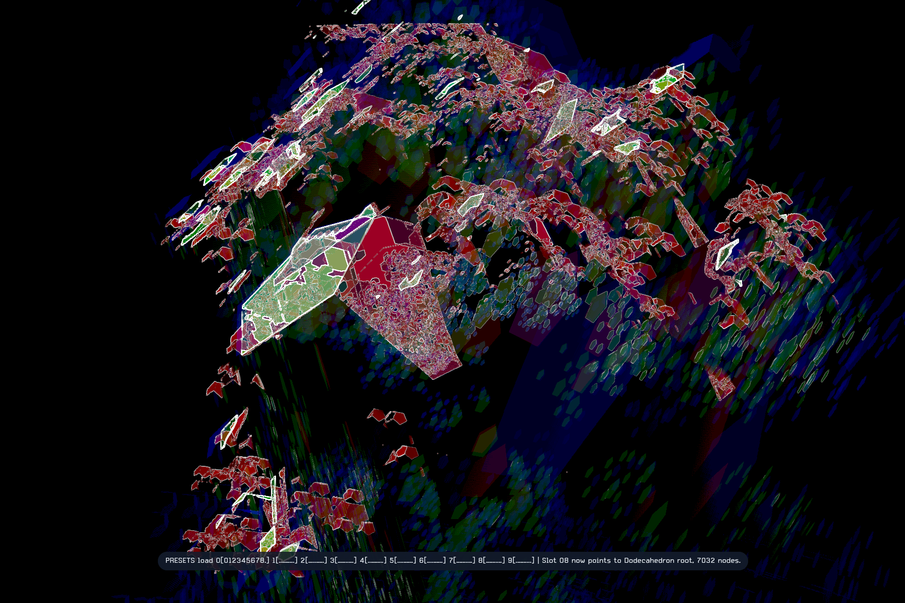
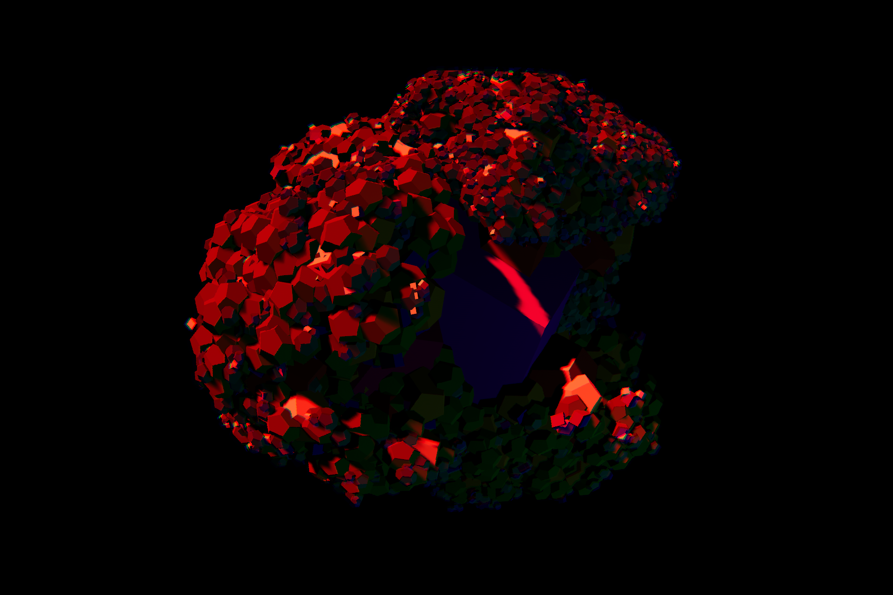
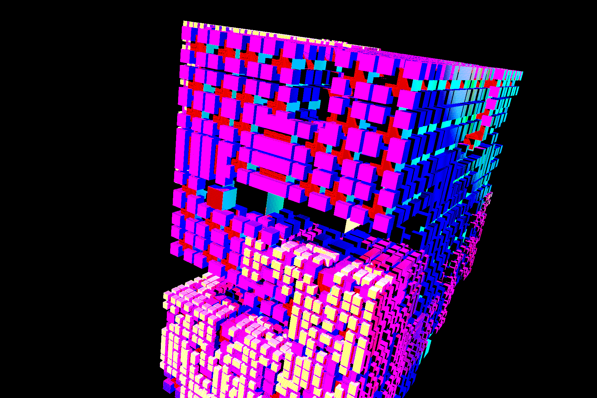
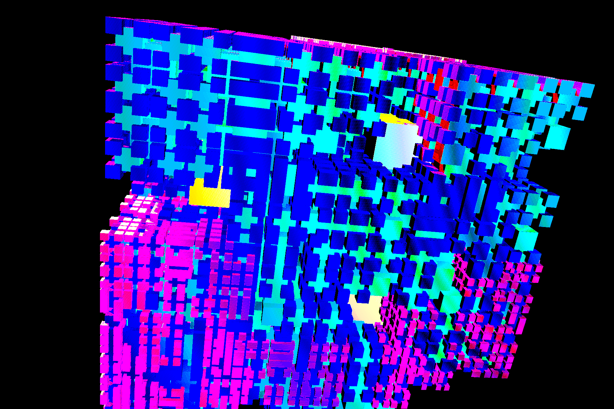

# intergen

Interactive 3D polyhedron generation tool built with Rust and Bevy.

Runtime tuning lives in `config.toml` at the repository root.

## Gallery





| View 1 | View 2 |
| --- | --- |
|  |  |
|  |  |
|  |  |
|  |  |

The current prototype focuses on a fast local development loop and a usable vertical slice:
- inertial camera rotation on all 3 axes with preserved angular momentum
- keyboard zoom
- recursive polyhedron spawning from parent vertices, edges, or faces
- selectable child shape type
- adjustable child scale ratio
- toggleable in-app keybinding overlay
- compact bottom FX strip for effect toggles, per-parameter LFOs, and numeric effect parameters
- built-in screenshot capture for manual and scripted verification
- Blender `.blend` export with compositor reconstruction and embedded effect/LFO metadata
- containment rejection so obviously hidden fully-inside spawns are skipped
- camera-output shader stack with hard-wrap wavefolder, lens distortion, gaussian blur, bloom, and edge detection

## Requirements

- Windows
- Rust stable MSVC toolchain
- Visual Studio 2022 Build Tools with the C++ workload
- Blender 5.x in `PATH` if you want `.blend` export (optional for normal app use)

## Font

UI text prefers `Carbon Plus` if you place a licensed font file in `assets/fonts/`.

Supported filenames:
- `assets/fonts/carbonplus-regular-bl.otf`
- `assets/fonts/CarbonPlus-Regular.ttf`
- `assets/fonts/CarbonPlus-Regular.otf`
- `assets/fonts/Carbon Plus Regular.ttf`
- `assets/fonts/Carbon Plus Regular.otf`
- `assets/fonts/CarbonPlus.ttf`
- `assets/fonts/Carbon Plus.ttf`
- `assets/fonts/carbonplus-bold-bl.otf`
- `assets/fonts/carbonplus-light-bl.otf`

If you override `ui.font_candidates` in `config.toml`, the built-in Carbon Plus filenames above are still appended as fallback candidates. If none of those files are present, the app falls back to Bevy's default font.

## Configuration

The app loads `config.toml` from the repository root on startup.

Current configuration sections:
- `window`: title, resolution, and present mode
- `rendering`: clear color, ambient light, and optional stage floor/backdrop surfaces
- `camera`: initial orbit, motion tuning, and angular-momentum preservation
- `generation`: root shape, default child shape, default spawn placement mode, scale limits, twist defaults and bounds, spawn cadence, and spawn heuristics
- `lighting`: directional, point, and optional accent light colors, positions, and intensities
- `effects`: camera-output shader effects
- `materials`: color progression, legacy or scene-wide procedural material families, PBR tuning, and live opacity defaults
- `capture`: screenshot output directory and default capture delay
- `ui`: font candidates plus overlay sizing and colors

If `config.toml` is missing, the app falls back to the same built-in defaults.

Live twist controls use these `generation` settings:
- `twist_per_vertex_radians`: startup default for the child twist angle
- `twist_adjust_step`: per-keypress twist change
- `twist_hold_delay_secs`: how long to hold before twist repeat starts
- `twist_repeat_interval_secs`: time between repeated twist updates while held
- `min_twist_per_vertex_radians` / `max_twist_per_vertex_radians`: live clamp range, with `0.0` as the minimum allowed floor

Live child-offset controls use these `generation` settings:
- `default_vertex_offset_ratio`: startup default for the center offset from the selected parent attachment point, measured in child-radius units
- `vertex_offset_adjust_step`: per-keypress offset change
- `vertex_offset_hold_delay_secs`: how long to hold before offset repeat starts
- `vertex_offset_repeat_interval_secs`: time between repeated offset updates while held
- `min_vertex_offset_ratio` / `max_vertex_offset_ratio`: live clamp range, with `0.0` as the minimum allowed floor

Live spawn-exclusion controls use these `generation` settings:
- `default_vertex_spawn_exclusion_probability`: startup default for the chance that a given attachment in the current spawn mode is skipped during spawning
- `vertex_spawn_exclusion_adjust_step`: per-keypress probability change
- `vertex_spawn_exclusion_hold_delay_secs`: how long to hold before repeat starts
- `vertex_spawn_exclusion_repeat_interval_secs`: time between repeated probability updates while held
- `min_vertex_spawn_exclusion_probability` / `max_vertex_spawn_exclusion_probability`: live clamp range, limited internally to `[0.0, 1.0]`

Camera-output effects run in this order:
- `effects.lens_distortion`: warp the camera image with radial, tangential, and chromatic lens terms
- `effects.color_wavefolder`: hard-wrap the distorted camera color by amplification plus remainder
- `effects.gaussian_blur`: blur the distorted and wavefolded image
- `effects.bloom`: add a bright-pass glow over the processed image
- `effects.edge_detection`: detect edges from the distorted and wavefolded image and mix a configurable edge color over it

Camera-output color wavefolder uses these `effects.color_wavefolder` settings:
- `enabled`: turns the hard-wrap post-process on or off
- `gain`: amplifies the color before wrapping
- `modulus`: the divisor whose remainder is kept after amplification

Camera-output lens distortion uses these `effects.lens_distortion` settings:
- `enabled`: turns lens warping on or off
- `strength`: primary radial barrel/pincushion term (`k1`)
- `radial_k2` / `radial_k3`: higher-order radial shaping terms for the shoulder of the warp
- `center`: distortion center in normalized screen coordinates
- `scale`: per-axis distortion scale for anamorphic or elliptical warping
- `tangential`: tangential skew terms that decenter the lens model
- `zoom`: scales the distorted image to keep more or less of the warped frame in view
- `chromatic_aberration`: shifts color channels apart along the distortion field

Camera-output gaussian blur uses these `effects.gaussian_blur` settings:
- `enabled`: turns blur on or off
- `sigma`: controls the gaussian falloff
- `radius_pixels`: blur radius in pixels, clamped to `16` in the current single-pass shader

Camera-output bloom uses these `effects.bloom` settings:
- `enabled`: turns bright-pass bloom on or off
- `threshold`: minimum brightness that contributes to the glow
- `intensity`: bloom contribution added back onto the processed image
- `radius_pixels`: bloom blur radius in pixels, clamped to `16` in the current single-pass shader

Camera-output edge detection uses these `effects.edge_detection` settings:
- `enabled`: turns the edge pass on or off
- `strength`: scales edge magnitude before thresholding
- `threshold`: subtracts a floor from the detected edge magnitude
- `mix`: blends the edge color over the processed image
- `color`: RGB edge overlay color

The in-app FX tuner starts from the values loaded from `config.toml` at launch.
- Live edits affect the running app only.
- `Tab` toggles the selected effect on or off.
- `L` toggles the selected parameter LFO on or off.
- `M` cycles the tuner edit target between parameter value, LFO amplitude, LFO frequency, and LFO shape.
- LFO shapes currently available are `sine`, `triangle`, `saw`, `square`, `stepped random`, and `brownian motion`.
- `Enter` resets the selected FX field.
- `Shift + Enter` resets all FX settings and LFOs to their startup defaults.
- The tuner does not write changes back to `config.toml` automatically.

Live opacity controls use these `materials` settings:
- `default_opacity`: startup default for all object materials
- `opacity_adjust_step`: per-keypress opacity change
- `min_opacity` / `max_opacity`: live clamp range


## Scene Presets

Press `F3` to toggle scene preset mode. The bottom preset strip shows the 10 banks (`0`-`9`), each with 10 slots.

Preset behavior:
- two digits (`00` to `99`) load the assigned scene preset for that bank and slot
- `S` arms saving, then the next two digits choose the bank and slot assignment
- `Delete` arms freeing, then the next two digits clear that slot assignment from any matching preset files
- `Esc` cancels the pending preset command
- if multiple preset files claim the same slot, a chooser appears; `Up` / `Down` selects which file keeps the slot and `Enter` confirms it

Preset files are stored as TOML under `scene-presets/`. Filenames are unique and are not based on the bank and slot, so saving a new preset never overwrites an older file by name. The bank and slot assignment lives inside the preset file metadata.

Current scene preset contents:
- render clear color and ambient light
- directional and point light settings
- material palette/PBR settings and current global opacity
- camera position, distance, and momentum
- current polyhedron tree, selected child shape, spawn placement mode, scale ratio, twist, outward offset, and global spawn-exclusion probability
- live camera-output effect values plus all per-parameter LFO settings
## Blender Export

Press `F4` during a normal interactive run to write a timestamped Blender scene under `blend-exports/`.

What the `.blend` currently includes:
- the full polyhedron scene as real Blender mesh objects
- the current camera, directional light, point light, and world background
- per-object materials with transparency, metallic, roughness, and reflectance-derived specular
- compositor recreation for lens distortion, hard-wrap wavefolder, gaussian blur, bloom, and edge detection
- embedded `Text` datablocks with the full Intergen export snapshot, evaluated effect values, and all effect/LFO runtime settings

Current limitation:
- LFOs are preserved inside the `.blend` as metadata, but they are not yet converted into native Blender animation drivers or node animation
- Blender's built-in compositor does not expose every Intergen lens-distortion term directly, so the exported compositor is a best-effort approximation while the full original parameters remain in the embedded metadata

For automated export-and-exit from the command line:

```powershell
cargo run -- --export-blend blend-exports\check.blend --export-blend-delay-frames 120
```

## Run

```powershell
cargo run
```

The default development build enables Bevy dynamic linking for faster rebuilds.

If you want to run without that mode:

```powershell
cargo run-plain
```

To save a verification screenshot and exit automatically:

```powershell
cargo run -- --capture screenshots\check.png --capture-delay-frames 120
```

During a normal interactive run, press `F12` to save a screenshot under `screenshots/`.

## Test

```powershell
cargo test
```

Without dynamic linking:

```powershell
cargo test-plain
```

## Controls

- `Arrow Up` / `Arrow Down`: pitch camera
- `Arrow Left` / `Arrow Right`: yaw camera
- `Q` / `E`: roll camera
- `W` / `S`: zoom in / out
- `Backspace`: stop camera rotation momentum
- `F1` or `H`: toggle the keybinding overlay
- `F2`: pin or unpin the bottom FX strip
- `Ctrl + Up` / `Ctrl + Down`: select the active FX parameter
- `Ctrl + Left` / `Ctrl + Right`: adjust the active FX field, with hold-to-repeat
- `Tab`: toggle the selected effect on or off
- `L`: toggle the selected parameter LFO on or off
- `M`: cycle FX tuner edit mode between value, LFO amplitude, LFO frequency, and LFO shape, including the new random drift shapes
- `Shift`: coarse FX adjustment modifier
- `Alt`: fine FX adjustment modifier
- `Enter`: reset the active FX field
- `Shift + Enter`: reset all FX settings and LFOs to their startup defaults
- `F4`: export the current scene to `blend-exports/` as a Blender `.blend`
- `F12`: save a screenshot to `screenshots/`
- `R`: reset the scene with the currently selected polyhedron as the new root
- `Space`: spawn child polyhedra with the current placement mode, or hold to keep spawning
- `G`: cycle the spawn placement mode between vertices, edges, and faces
- `1`: select cube
- `2`: select tetrahedron
- `3`: select octahedron
- `4`: select dodecahedron
- `-`: decrease child scale ratio
- `+`: increase child scale ratio
- `[` or `,`: decrease child twist angle, or hold to keep decreasing
- `]` or `.`: increase child twist angle, or hold to keep increasing
- `Z`: decrease the child outward offset, or hold to keep decreasing
- `X`: increase the child outward offset, or hold to keep increasing
- `C`: reset the child outward offset to the configured default
- `V`: decrease the global spawn-exclusion probability, or hold to keep decreasing
- `B`: increase the global spawn-exclusion probability, or hold to keep increasing
- `N`: reset the global spawn-exclusion probability to the configured default
- `O`: decrease global object opacity
- `P`: increase global object opacity
- `I`: reset global object opacity to the configured default
- `T`: reset the child twist angle to the configured default

## Build Notes

- `cargo run` does not always recompile. If nothing relevant changed, Cargo reuses the existing build output.
- Editing Rust source files should usually rebuild only `intergen`.
- Changing `Cargo.toml`, enabled features, toolchain, or profile settings can trigger a larger one-time rebuild.
- `cargo check` is the fastest command for type-checking without launching the app.

## Current Scope

Implemented now:
- custom meshes for cube, tetrahedron, octahedron, and dodecahedron
- recursive level-by-level spawning
- metallic lit PBR scene
- camera-output hard-wrap wavefolder, lens distortion, gaussian blur, bloom, and edge-detection post process
- unit tests for geometry counts and spawn ordering

Not implemented yet:
- mouse controls
- hardware ray tracing
- more advanced visibility heuristics than simple containment rejection
- automatic conversion of effect LFOs into native Blender animation/drivers

## License

`intergen` is licensed under `GPL-3.0-or-later`.

Copyright (C) 2026 Francesco Stablum.

See [LICENSE](LICENSE) for the project notice and [COPYING](COPYING) for the full GNU General Public License text.

