# Shape spawning: geometry and placement guide

This guide explains every control that changes **what gets spawned, where it is
placed, how it is oriented, and how large it is**. It covers the direct keyboard
shortcuts, the generation controls on the `F2` page, the related
`[generation]` configuration values, and the rules Intergen applies behind the
scenes.

> [!TIP]
> If you only remember one workflow: choose a shape with `1`–`4`, choose an
> attachment type with `G`, tune size with `-` / `+`, then tap `Space`. Use
> `[` / `]` for rotation around the attachment direction and `Z` / `X` for
> distance away from the parent.

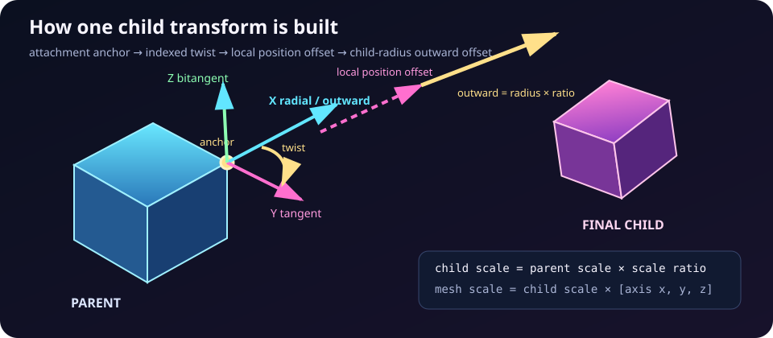

## Contents

- [The mental model](#the-mental-model)
- [Direct-key quick reference](#direct-key-quick-reference)
- [Editing generation parameters with F2](#editing-generation-parameters-with-f2)
- [Shape kind: 1, 2, 3, 4](#shape-kind-1-2-3-4)
- [Placement mode: G](#placement-mode-g)
- [Add mode and spawning: Ctrl+Space and Space](#add-mode-and-spawning-ctrlspace-and-space)
- [Single-source repeat count: comma and period](#single-source-repeat-count-comma-and-period)
- [Uniform child scale ratio: minus and plus](#uniform-child-scale-ratio-minus-and-plus)
- [Per-axis child scale: F2 only](#per-axis-child-scale-f2-only)
- [Twist: brackets and T](#twist-brackets-and-t)
- [Outward offset: Z, X, and C](#outward-offset-z-x-and-c)
- [Local position offset: F2 only](#local-position-offset-f2-only)
- [Spawn exclusion: V, B, and N](#spawn-exclusion-v-b-and-n)
- [Resetting the scene: R](#resetting-the-scene-r)
- [Traversal, occupied attachments, and rejected spawns](#traversal-occupied-attachments-and-rejected-spawns)
- [What changes existing shapes?](#what-changes-existing-shapes)
- [Generation LFOs](#generation-lfos)
- [Configuration reference](#configuration-reference)
- [Practical recipes](#practical-recipes)
- [Troubleshooting](#troubleshooting)
- [Glossary](#glossary)

## The mental model

Intergen stores the scene as a **tree of shapes**. The first shape is the root at
level 0. Every child remembers:

- its parent;
- the parent attachment it came from—a vertex, edge midpoint, or face center;
- its uniform scale and per-axis scale;
- its copied local position offset;
- its level in the tree.

One press of `Space` searches the tree in level order for the first valid
attachment, constructs a child transform there, and appends the child to the
tree. Later children may therefore spawn from earlier children.

The child transform is easiest to understand as four operations:

1. Select the parent attachment and its outward direction.
2. Rotate the child by `attachment index × twist` around that direction.
3. Move in the child-local spawn frame with position offset X/Y/Z.
4. Move farther outward by `child radius × outward offset ratio`.

The child uniform scale is calculated separately as:

```text
child uniform scale = parent uniform scale × child scale ratio
rendered child scale = child uniform scale × child axis scale (component-wise)
```

## Direct-key quick reference

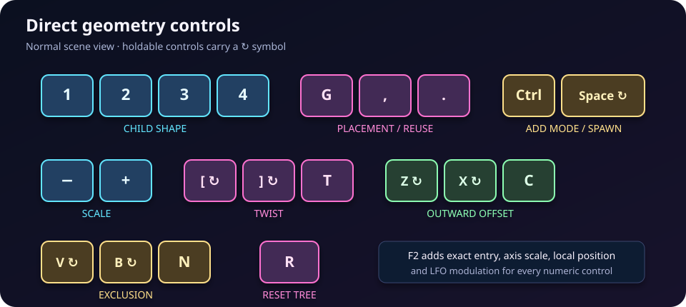

These keys work in the normal scene view. When an `F` page is focused, its input
mask may claim the same keys for page navigation or editing.

| Key | Change | Range / cycle | Existing shapes? |
| --- | --- | --- | --- |
| `1` | Select cube for future children | cube | No |
| `2` | Select tetrahedron for future children | tetrahedron | No |
| `3` | Select octahedron for future children | octahedron | No |
| `4` | Select dodecahedron for future children | dodecahedron | No |
| `G` | Cycle attachment placement | vertex → edge → face → vertex | No |
| `Ctrl` + `Space` | Cycle add mode | single → fill current level → single | No |
| `Space` | Spawn using the current settings | tap once; hold to repeat | Adds shapes |
| `,` | Decrease single-source repeat count | minimum `0` | No |
| `.` | Increase single-source repeat count | unbounded integer | No |
| `-` | Decrease child uniform scale ratio | configured bounds | No |
| `+` | Increase child uniform scale ratio | configured bounds | No |
| `[` | Decrease twist | configured bounds; hold repeats | **Yes—reflows** |
| `]` | Increase twist | configured bounds; hold repeats | **Yes—reflows** |
| `T` | Reset twist | configured startup default | **Yes—reflows** |
| `Z` | Decrease outward offset | configured bounds; hold repeats | **Yes—reflows** |
| `X` | Increase outward offset | configured bounds; hold repeats | **Yes—reflows** |
| `C` | Reset outward offset | configured startup default | **Yes—reflows** |
| `V` | Decrease exclusion probability | configured bounds within 0–100%; hold repeats | No |
| `B` | Increase exclusion probability | configured bounds within 0–100%; hold repeats | No |
| `N` | Reset exclusion probability | configured startup default | No |
| `R` | Replace the whole tree with the selected shape as root | root only | **Deletes descendants** |

`+` is the main keyboard `=` / `+` key or numpad add; `-` also accepts numpad
subtract. Scale changes are one step per press, while twist, outward offset,
exclusion, and `Space` support hold-to-repeat.

## Editing generation parameters with F2

The direct keys are the fast path. The `F2` page exposes all geometry values,
including per-axis scale and local position offset.

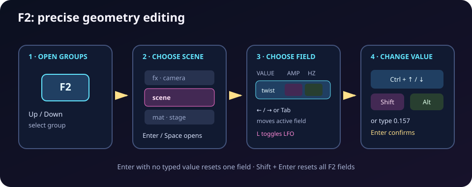

1. Press `F2` once to open parameter groups.
2. Select the `scene` group with `Up` / `Down`, then press `Enter` or `Space`.
   Alternatively, a second `F2` opens compact controls and a third opens the
   complete list.
3. Use `Up` / `Down` to select a row.
4. Use `Ctrl` + `Up` / `Down` to change the active field. Hold `Shift` for a
   coarse step or `Alt` for a fine step.
5. For an exact value, type digits plus `.`, `,`, `-`, or `+`, then press
   `Enter`. `Backspace` edits the typed value.
6. If the row supports an LFO, use `Left` / `Right` or `Tab` /
   `Shift` + `Tab` to move among value, amplitude, frequency, and shape. Press
   `L` to toggle modulation.

With no typed number pending, `Enter` resets the selected field. `Shift` +
`Enter` resets **all** F2 controls to their startup values.

### F2 scene-generation rows

| F2 row | Stable ID | Direct key | What it controls |
| --- | --- | --- | --- |
| shape | `generation.child_kind` | `1`–`4` | Child mesh for future spawns |
| placement | `generation.spawn_placement_mode` | `G` | Vertex, edge, or face attachments |
| add mode | `generation.spawn_add_mode` | `Ctrl` + `Space` | One child or a complete level |
| scale | `generation.child_scale_ratio` | `-` / `+` | Inherited uniform scale multiplier |
| axis x | `generation.child_axis_scale.x` | — | Radial-axis scale copied into new nodes |
| axis y | `generation.child_axis_scale.y` | — | Local Y-axis scale copied into new nodes |
| axis z | `generation.child_axis_scale.z` | — | Local Z-axis scale copied into new nodes |
| twist | `generation.child_twist_per_vertex_radians` | `[` / `]`, `T` | Indexed rotation around attachment normal |
| offset | `generation.child_outward_offset_ratio` | `Z` / `X`, `C` | Extra separation in child-radius units |
| pos x | `generation.child_position_offset.x` | — | Radial local position offset |
| pos y | `generation.child_position_offset.y` | — | Tangential local position offset |
| pos z | `generation.child_position_offset.z` | — | Bitangential local position offset |
| spawn% | `generation.child_spawn_exclusion_probability` | `V` / `B`, `N` | Deterministic attachment filtering |

The ten numeric rows—scale, axis X/Y/Z, twist, outward offset, position X/Y/Z,
and spawn percentage—support LFOs. Shape, placement, and add mode are value-only.

## Shape kind: 1, 2, 3, 4

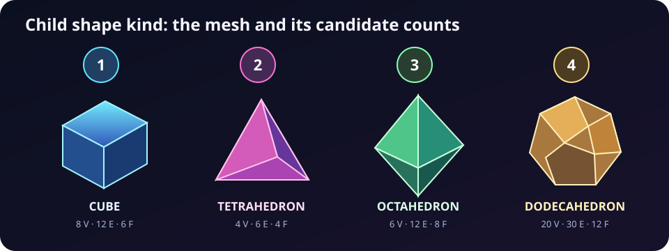

`1`, `2`, `3`, and `4` choose the mesh for **future child spawns**:

| Key | Shape | Vertices | Edges | Faces |
| --- | --- | ---: | ---: | ---: |
| `1` | Cube | 8 | 12 | 6 |
| `2` | Tetrahedron | 4 | 6 | 4 |
| `3` | Octahedron | 6 | 12 | 8 |
| `4` | Dodecahedron | 20 | 30 | 12 |

The counts matter because placement mode offers one candidate per attachment.
For example, a cube parent has 8 vertex candidates but only 6 face candidates.
Changing the selected shape does not alter existing nodes.

The selected shape also determines what `R` makes into the new root.

## Placement mode: G

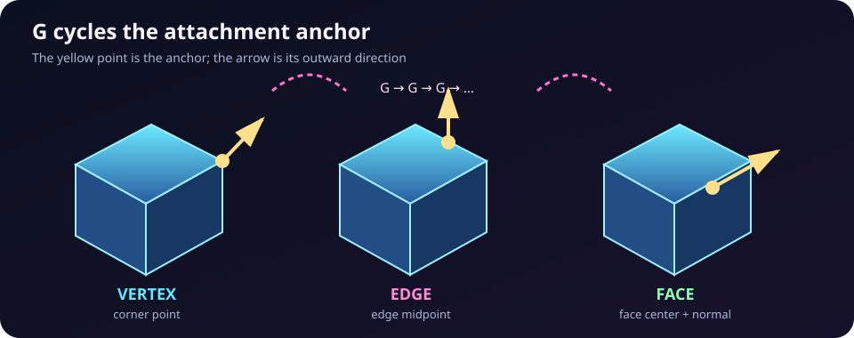

`G` cycles `vertex → edge → face → vertex`. The mode chooses attachment anchors
on every potential parent:

- **Vertex:** the anchor is a vertex; outward points from the parent center
  through that vertex.
- **Edge:** the anchor is the midpoint of an edge; outward is the normalized sum
  of that edge's endpoint directions.
- **Face:** the anchor is the face center; outward follows the face normal.

The child center starts at the selected anchor. Position offset and outward
offset may then move it. Changing placement mode resets the single-source cursor
so the next single spawn searches afresh.

Placement is a future-spawn setting: existing children remember the attachment
mode and index from which they were created.

## Add mode and spawning: Ctrl+Space and Space

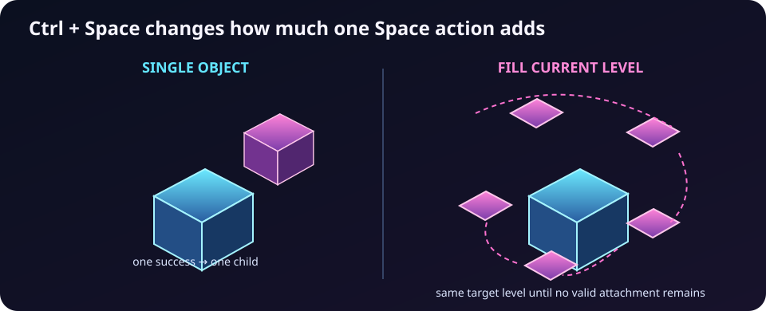

`Ctrl` + `Space` cycles between:

- **single object:** one successful `Space` action adds one child;
- **fill current level:** the first valid child establishes a target level, then
  Intergen keeps adding at that same level until no valid attachment remains.

Tap `Space` for one spawn action. Hold it for repeated actions after
`spawn_hold_delay_secs`, at the cadence of `spawn_repeat_interval_secs`.

Fill mode is not “fill the whole infinite tree.” It fills one breadth level per
action. A later press can begin the next level. It also samples generation LFOs
at a small virtual time increment per successful child, allowing visible
variation inside one batch.

## Single-source repeat count: comma and period

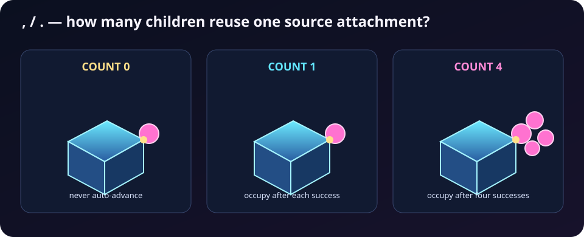

This control applies only in **single object** add mode:

- `,` decreases the count, stopping at `0`;
- `.` increases it;
- `0` means keep using one source attachment indefinitely;
- `1` means advance after every successful spawn—the traditional one-child-per-
  attachment behavior;
- `N > 1` means spawn `N` successful children from that attachment, then mark it
  occupied and advance.

The count tracks successful spawns, not keypresses. If a candidate is excluded
or rejected, it does not consume a repetition. Changing the count, placement
mode, or add mode finalizes the current cursor so the next spawn searches for a
new source.

Repeated children share the source attachment but may still differ because of
LFO values or their child mesh transform.

## Uniform child scale ratio: minus and plus

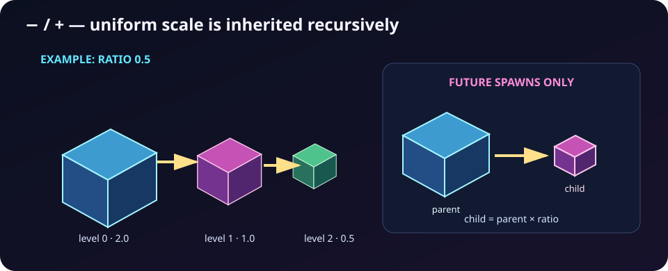

`-` and `+` change the child scale ratio by `scale_adjust_step` within
`min_scale_ratio..max_scale_ratio`.

For a parent with uniform scale `2.0` and ratio `0.5`, the child stores scale
`1.0`. Its child stores `0.5`, and so on. This produces geometric size decay
down the tree when the ratio is below 1.

Important distinctions:

- The ratio multiplies the parent's **uniform** scale, not the parent's per-axis
  scale.
- A child copies the current per-axis scale independently.
- Changing the ratio affects future nodes only. Existing node scales are stored
  and do not change.
- The displayed mesh scale is the stored uniform scale multiplied component-wise
  by the node's axis scale.

## Per-axis child scale: F2 only

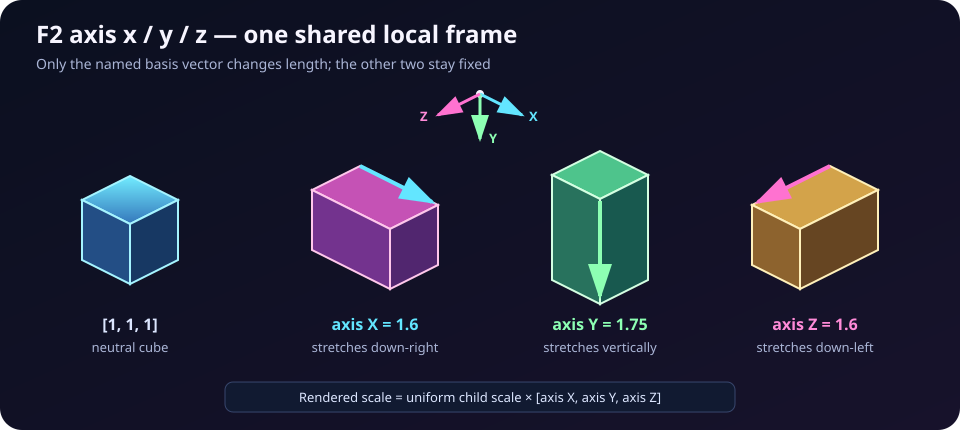

The F2 rows `axis x`, `axis y`, and `axis z` set a non-uniform scale copied into
each newly spawned node. `[1, 1, 1]` preserves the mesh proportions; increasing
one component stretches that local axis, while a value between 0 and 1 squashes
it.

All three values are clamped to the configured positive range. They affect:

- future children;
- the new root made by `R`;
- containment and placement calculations through the node's scaled bounding
  radius.

They do not rewrite existing nodes. Note that F2 labels these mesh-local axes
X/Y/Z; they are not the radial/tangent/bitangent axes of position offset.

## Twist: brackets and T

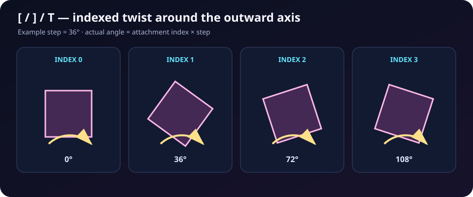

- `[` decreases twist by `twist_adjust_step`;
- `]` increases it;
- holding either key repeats after the configured delay;
- `T` restores `twist_per_vertex_radians`.

Twist is in radians internally, and the runtime status also shows degrees. The
actual rotation for an attachment is:

```text
twist angle = attachment index × twist-per-attachment
child rotation = twist rotation around outward axis × parent rotation
```

At twist `0`, every child inherits the parent rotation. With a 36° step,
attachment 0 gets 0°, attachment 1 gets 36°, attachment 2 gets 72°, and so on.
This indexed progression creates spirals and rotational rhythm around a parent.

Twist is one of two live parameters that **recomputes all existing child
rotations and centers**. Each child keeps its original parent and attachment,
so the tree is re-laid-out rather than regenerated.

## Outward offset: Z, X, and C

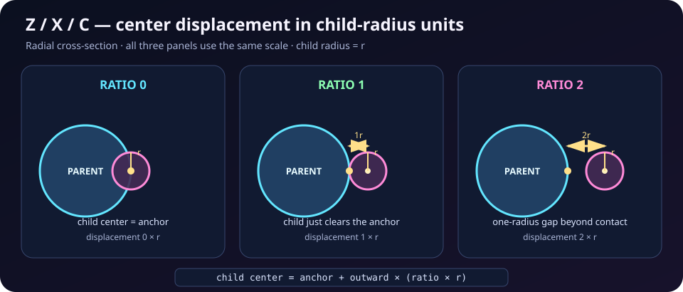

- `Z` decreases the ratio;
- `X` increases it;
- holding either key repeats;
- `C` restores `default_vertex_offset_ratio`.

The extra displacement is:

```text
extra outward distance = child's scaled bounding radius × outward offset ratio
```

A ratio of `0` leaves the child center at the offset attachment anchor. A ratio
of `1` moves it one child radius farther outward. Because the child's bounding
radius includes uniform and per-axis scale, a stretched child can move farther
than a compact one at the same ratio.

After applying local position offset, Intergen recalculates the effective
outward direction from the parent center toward the offset anchor. Outward
offset follows that direction.

Like twist, changing outward offset **recomputes all existing descendants**.

## Local position offset: F2 only

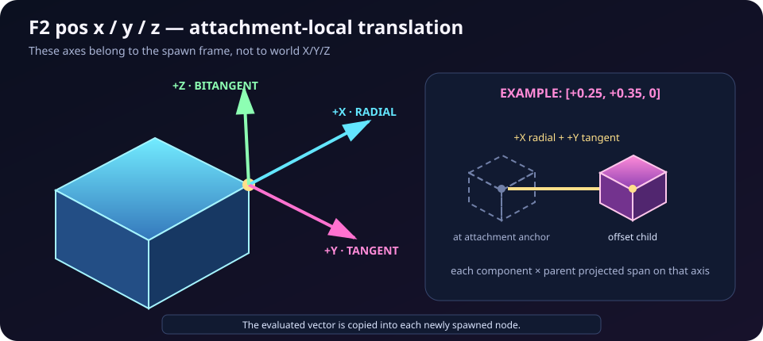

The F2 rows `pos x`, `pos y`, and `pos z` move future children in a local spawn
frame:

- **X = radial:** along the attachment's outward direction;
- **Y = tangent:** across the parent surface, derived from the rotated child's
  local Y axis when possible;
- **Z = bitangent:** perpendicular to radial and tangent.

Each component is clamped to `[-1, 1]`. It is multiplied by the parent's full
projected span along that frame axis, so `0.25` means one quarter of the parent's
width in that direction—not 0.25 world units.

The evaluated vector is copied into every new node. Existing nodes preserve
their stored vector. Editing the shared F2 value therefore affects future
spawns only, but later twist or outward-offset recomputation will reuse each
existing node's copied vector.

## Spawn exclusion: V, B, and N

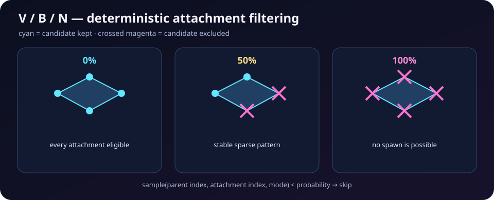

- `V` decreases the probability;
- `B` increases it;
- holding either key repeats;
- `N` restores the configured default.

The value is clamped within 0–1 and displayed as a percentage. For each parent
index, attachment index, and placement mode, Intergen generates a deterministic
sample. The attachment is skipped when that sample is below the probability.

This means:

- `0%` excludes nothing;
- `100%` excludes everything, so `Space` cannot spawn;
- intermediate results are repeatable for the same tree and mode, not freshly
  random on every keypress;
- the percentage is a global filter, not a persistent per-attachment flag;
- changing it affects future candidate searches only.

## Resetting the scene: R

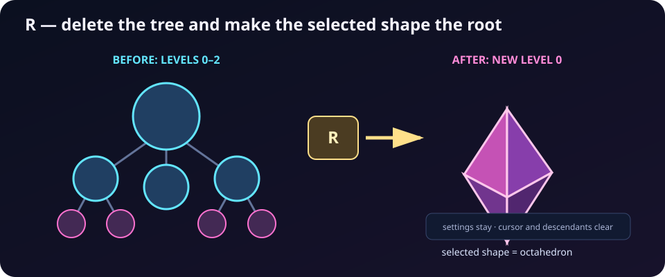

`R` despawns every rendered shape and replaces the model with a single root:

- root mesh = currently selected child shape (`1`–`4`);
- root uniform scale = configured `root_scale`;
- root axis scale = current evaluated axis X/Y/Z values;
- root center = world origin;
- root rotation = identity;
- local position offset = zero.

Generation settings such as selected shape, placement mode, add mode, scale
ratio, twist, offsets, exclusion, and repeat count remain available after the
reset. The attachment cursor and held-spawn state are cleared.

## Traversal, occupied attachments, and rejected spawns

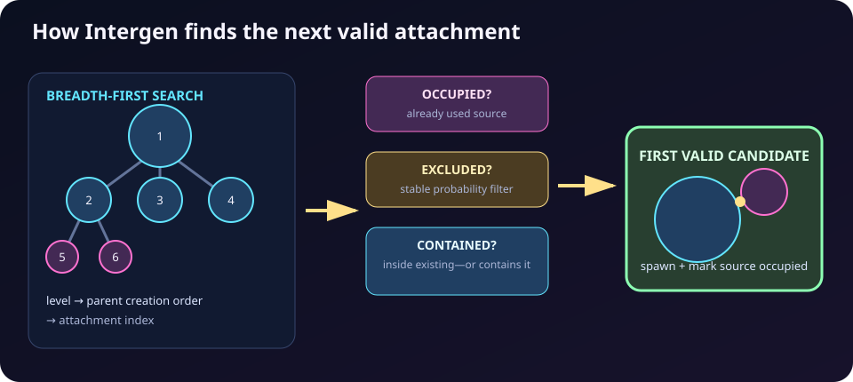

For an ordinary single spawn without an active repeat cursor, Intergen searches:

1. parent level from shallowest to deepest;
2. parents in node creation order;
3. attachments in geometry index order.

A candidate is skipped if:

- the attachment is already occupied;
- spawn exclusion filters it;
- the candidate is fully contained by an existing shape;
- the candidate fully contains an existing shape.

Containment uses each shape's conservative scaled bounding radius and
`containment_epsilon`. It prevents obviously hidden or engulfing spawns; it is
not a general collision detector, so partial intersections are allowed.

An attachment is normally marked occupied after a successful spawn. The
single-source repeat feature deliberately delays that mark until its requested
number of successful spawns has been reached.

## What changes existing shapes?

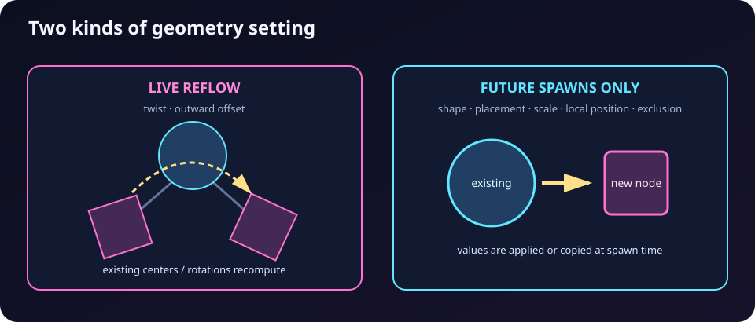

| Setting | Existing nodes | Future nodes |
| --- | --- | --- |
| child shape | unchanged | uses new mesh |
| placement mode | unchanged | uses new attachment type |
| add mode | unchanged | changes batch size |
| scale ratio | unchanged | changes inherited uniform scale |
| axis scale X/Y/Z | unchanged | copied into node |
| twist | **recomputes rotations and centers** | used at spawn |
| outward offset | **recomputes centers** | used at spawn |
| position offset X/Y/Z | stored value unchanged | evaluated vector copied into node |
| exclusion probability | unchanged | filters candidate attachments |
| single-source repeat count | unchanged | changes cursor advance behavior |
| `R` | **deletes the whole tree** | creates one new root |

The key distinction is **shared live layout values** versus **copied spawn-time
values**. Twist and outward offset are shared and can reflow the tree. Scale and
local position values are materialized into each node when it is created.

## Generation LFOs

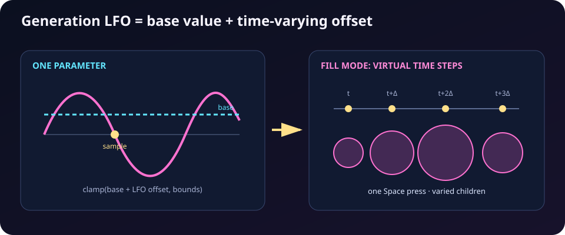

Every numeric generation row supports an LFO. The evaluated value is:

```text
effective value = clamp(base value + LFO offset, parameter bounds)
```

- Scale ratio, axis scale X/Y/Z, position offset X/Y/Z, and exclusion are sampled
  when a child is spawned and then copied or applied to that spawn decision.
- Twist and outward offset are shared live values; their LFO offsets can drive
  live tree recomputation through the runtime scene-parameter path.
- Presets save base values and LFO settings separately.
- Manual changes appear on `F5`; continuously changing LFO samples do not flood
  the recent-changes page.

In fill-current-level mode, successive children use virtual sample times:

```text
sample time for child i = current time + i × fill_mode_lfo_virtual_time_step_secs
```

That is why one `Space` press can produce alternating or gradually changing
children even though the batch is created in a single frame.

## Configuration reference

The app loads `[generation]` from [`config.toml`](../config.toml) at startup. F2
edits are runtime-only and are not written back automatically. Values omitted
from the file use built-in defaults.

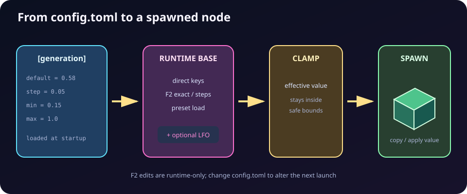

### Geometry defaults and bounds

| Field | Effective value in this repository | Meaning |
| --- | --- | --- |
| `root_shape_kind` | `cube` via alias `root_kind` | Root mesh on startup |
| `root_scale` | `1.9` | Root uniform scale on startup and `R` |
| `default_child_shape_kind` | `cube` via alias `default_child_kind` | Initially selected child mesh |
| `default_spawn_placement_mode` | `vertex` (built-in) | Initial attachment mode |
| `default_scale_ratio` | `0.58` | Initial uniform child multiplier |
| `scale_adjust_step` | `0.05` | `-` / `+` step and base F2 step |
| `min_scale_ratio` | `0.15` | Lower scale-ratio clamp |
| `max_scale_ratio` | `1.0` | Upper scale-ratio clamp |
| `default_child_axis_scale` | `[1, 1, 1]` (built-in) | Initial X/Y/Z mesh scale; also startup root axis scale |
| `child_axis_scale_adjust_step` | `0.05` (built-in) | Base F2 axis-scale step |
| `min_child_axis_scale` | `0.01` (built-in) | Positive lower clamp; never below 0.01 |
| `max_child_axis_scale` | `100.0` (built-in) | Upper axis-scale clamp |
| `twist_per_vertex_radians` | `0.62831855` = 36° | Initial/reset indexed twist step |
| `twist_adjust_step` | `0.017453292` = 1° | `[` / `]` and base F2 step |
| `min_twist_per_vertex_radians` | `0` | Lower twist clamp; never negative |
| `max_twist_per_vertex_radians` | `π` = 180° | Upper twist clamp |
| `default_vertex_offset_ratio` | `0` (built-in) | Initial/reset outward separation in child radii |
| `vertex_offset_adjust_step` | `0.1` (built-in) | `Z` / `X` and base F2 step |
| `min_vertex_offset_ratio` | `0` (built-in) | Lower outward-offset clamp; never negative |
| `max_vertex_offset_ratio` | `6` (built-in) | Upper outward-offset clamp |
| `default_child_position_offset` | `[0, 0, 0]` | Initial radial/tangent/bitangent offset |
| `child_position_offset_adjust_step` | `0.05` | Base F2 step; each component is always clamped to `[-1, 1]` |
| `default_vertex_spawn_exclusion_probability` | `0` (built-in) | Initial/reset attachment exclusion chance |
| `vertex_spawn_exclusion_adjust_step` | `0.05` (built-in) | `V` / `B` and base F2 step |
| `min_vertex_spawn_exclusion_probability` | `0` (built-in) | Lower clamp, itself restricted to 0–1 |
| `max_vertex_spawn_exclusion_probability` | `1` (built-in) | Upper clamp, itself restricted to 0–1 |

The historical `vertex_` names remain even when edge or face placement is
active; the values apply to all placement modes.

### Spawning cadence and search behavior

| Field | Effective value in this repository | Meaning |
| --- | --- | --- |
| `default_single_attachment_repeat_count` | `1` | Startup single-source reuse count |
| `spawn_hold_delay_secs` | `0.24` | Delay before held `Space` begins repeating |
| `spawn_repeat_interval_secs` | `0.00005` | Interval between held spawn actions |
| `fill_mode_lfo_virtual_time_step_secs` | `0.25` | LFO sample-time advance per successful fill child; clamped nonnegative |
| `containment_epsilon` | `0.02` | Tolerance in bounding-radius containment rejection |
| `twist_hold_delay_secs` | `0.24` (built-in) | Delay before held bracket repeat |
| `twist_repeat_interval_secs` | `0.07` (built-in) | Bracket repeat interval |
| `vertex_offset_hold_delay_secs` | `0.24` (built-in) | Delay before held `Z` / `X` repeat |
| `vertex_offset_repeat_interval_secs` | `0.07` (built-in) | Outward-offset repeat interval |
| `vertex_spawn_exclusion_hold_delay_secs` | `0.24` (built-in) | Delay before held `V` / `B` repeat |
| `vertex_spawn_exclusion_repeat_interval_secs` | `0.07` (built-in) | Exclusion repeat interval |

To make omitted values explicit, a complete geometry-focused block could be:

```toml
[generation]
root_shape_kind = "cube"
root_scale = 1.9
default_child_shape_kind = "cube"
default_spawn_placement_mode = "vertex"

default_scale_ratio = 0.58
scale_adjust_step = 0.05
min_scale_ratio = 0.15
max_scale_ratio = 1.0

default_child_axis_scale = [1.0, 1.0, 1.0]
child_axis_scale_adjust_step = 0.05
min_child_axis_scale = 0.01
max_child_axis_scale = 100.0

default_single_attachment_repeat_count = 1
spawn_hold_delay_secs = 0.24
spawn_repeat_interval_secs = 0.00005
fill_mode_lfo_virtual_time_step_secs = 0.25
containment_epsilon = 0.02

twist_per_vertex_radians = 0.62831855
twist_adjust_step = 0.017453292
twist_hold_delay_secs = 0.24
twist_repeat_interval_secs = 0.07
min_twist_per_vertex_radians = 0.0
max_twist_per_vertex_radians = 3.1415927

default_vertex_offset_ratio = 0.0
vertex_offset_adjust_step = 0.1
vertex_offset_hold_delay_secs = 0.24
vertex_offset_repeat_interval_secs = 0.07
min_vertex_offset_ratio = 0.0
max_vertex_offset_ratio = 6.0

default_child_position_offset = [0.0, 0.0, 0.0]
child_position_offset_adjust_step = 0.05

default_vertex_spawn_exclusion_probability = 0.0
vertex_spawn_exclusion_adjust_step = 0.05
vertex_spawn_exclusion_hold_delay_secs = 0.24
vertex_spawn_exclusion_repeat_interval_secs = 0.07
min_vertex_spawn_exclusion_probability = 0.0
max_vertex_spawn_exclusion_probability = 1.0
```

## Practical recipes

### A clean recursive shrink

1. Press `1` for cubes.
2. Press `G` until placement is `vertices`.
3. Set scale near `0.5` with `-` / `+` or F2.
4. Press `T`, then use `[` / `]` for a small twist.
5. Press `C` for zero outward offset.
6. Tap `Space` repeatedly.

### A complete face shell

1. Choose a child with `1`–`4`.
2. Cycle `G` to `faces`.
3. Cycle `Ctrl` + `Space` to `fill current level`.
4. Set exclusion to `0%` with `V` or an exact F2 value.
5. Tap `Space` once per desired tree level.

### A fan from one attachment

1. Use single-object mode.
2. Increase the repeat count with `.` to `5`, or set it to `0` for unlimited
   reuse.
3. Enable an LFO on twist, position Y, or scale.
4. Hold `Space` briefly.

### A sideways ribbon

1. Open the F2 `scene` group.
2. Set `axis x` below `1` and one of `axis y` / `axis z` above `1`.
3. Set `pos y` to a small nonzero value.
4. Use edge placement and a low scale ratio.
5. Add a small twist to rotate successive ribbon segments.

## Troubleshooting

### “Space says no valid spawn position”

Check these in order:

1. Exclusion may be `100%`; press `N` or set spawn% to `0` in F2.
2. Every attachment in the current mode may be occupied; press `G` to try a
   different mode or grow from a deeper level.
3. The candidate may be fully contained by—or fully contain—another shape; lower
   scale, change placement, or add outward offset.
4. A repeat cursor may point at a source that became invalid under changed
   settings; changing placement/add mode or repeat count starts a fresh search.

### “Changing scale did not resize shapes already on screen”

That is intentional. Scale ratio and axis scale are copied at spawn time. Reset
with `R` or spawn new children to see the new values. Twist and outward offset
are the live reflow controls.

### “Position X does not look like world X”

Position-offset axes are attachment-local. X is radial, Y is tangent, and Z is
bitangent. They rotate with the attachment and child frame.

### “A 50% exclusion setting does not change on every attempt”

Exclusion is deterministic for a parent/attachment/mode tuple. It creates a
stable sparse pattern rather than rolling fresh randomness for every press.

### “Fill mode produced differently sized children in one press”

A generation LFO is probably enabled. Fill mode advances virtual LFO time per
successful child by `fill_mode_lfo_virtual_time_step_secs`.

## Glossary

**Attachment.** A numbered vertex, edge, or face on a parent that can source a
child.

**Anchor.** The world-space point at the selected attachment before child position and
outward offsets.

**Outward / radial.** The normalized direction from the parent center toward an
attachment anchor.

**Tangent / bitangent.** The two perpendicular axes across the parent surface that complete the local
spawn frame.

**Level.** Tree depth: root is 0, its children are 1, their children are 2, and
so on.

**Uniform scale.** One scalar inherited recursively through
`parent scale × scale ratio`.

**Axis scale.** A stored three-component multiplier that stretches or squashes a node's local
mesh axes.

**Bounding radius.** A conservative radius based on the largest absolute combined scale component;
used for outward-distance and containment calculations.

**Reflow.** Recomputing existing child centers/rotations from their stored parent and
attachment without changing the tree membership.

**Base value / effective value.** The manually stored value versus that value plus an LFO offset, clamped to the
parameter bounds.
